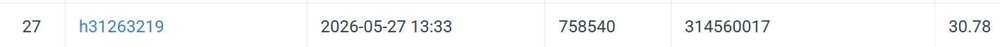

# NYCU Computer Vision 2026 HW4

- **Student ID:** 314560017
- **Name:** 陳沛妤

## Introduction

This repository tackles **Homework 4 — Image Restoration with PromptIR**
of the NYCU 2026 Spring Visual Recognition course. We restore 256×256
RGB images that have been corrupted by either **rain** or **snow** —
with the degradation type unknown at test time — using a **single**
PromptIR model and submit the results to CodaBench, where evaluation
is by **PSNR**.

The submitted model is **PromptIR-medium** (Potlapalli *et al.*,
NeurIPS 2023) — a from-scratch implementation of the Restormer
backbone (MDTA + GDFN transformer blocks in a 4-level U-Net) with
three **Prompt Generation Blocks** inserted in the decoder. Three
architectural choices, each picked after an isolated experiment,
contributed to the final score:

1. **`medium` config** (dim = 48, blocks = (2, 3, 3, 4)) instead of
   the published `light` (dim = 36). Widens the channels for more
   capacity without making the deepest-level attention blow up.
   **24.88 M** trainable parameters, well under the 200 M cap.
2. **Charbonnier loss** `sqrt(x² + 1e-6)` instead of L1. The
   stronger gradient near zero accelerates the late-epoch
   denoising regime that determines the final dB.
3. **Patch size 192** instead of the more common 128. Wider
   training tiles let the network see enough surrounding texture
   to disambiguate fine residual streaks — the qualitative
   failure mode at patch 128.

Together, these push **test PSNR from 29.75 (baseline `light` + L1)
→ 30.78** on the CodaBench public leaderboard, a **+1.03 dB** gain.
Report §4 isolates the contribution of the Prompt Generation Block
itself via a paired with/without retrain.

## Environment Setup

### Prerequisites

- Python 3.12
- CUDA-compatible GPU (training on RTX 5070, 12 GB)
- PyTorch ≥ 2.0 with CUDA

### Installation

```powershell
# 1. (Optional) create a virtualenv
python -m venv .venv
.\.venv\Scripts\Activate.ps1

# 2. Install PyTorch + CUDA (pick the build that matches your CUDA)
#    Tested with torch 2.12 + cu130 on Windows 11.
pip install torch torchvision --index-url https://download.pytorch.org/whl/cu130

# 3. Install the remaining Python dependencies
pip install -r requirements.txt
```

`requirements.txt` covers numpy, pillow, tqdm, matplotlib,
markdown-pdf (for report rendering), pymupdf.

## Dataset Layout

Place the official `hw4_realse_dataset` archive at the project
root:

```
hw4_realse_dataset/
├── train/
│   ├── degraded/   rain-1.png … rain-1600.png, snow-1.png … snow-1600.png
│   └── clean/      rain_clean-1.png …,         snow_clean-1.png …
└── test/
    └── degraded/   0.png … 99.png   (type unknown at test time)
```

The training set yields 3,200 paired (degraded, clean) tuples
(1,600 rain + 1,600 snow). The dataset loader (`dataset.py`)
splits 50 rain + 50 snow off for validation by default; the
remaining 3,100 are used for training.

## Usage

### Training the submitted model

```powershell
python train.py `
    --data-root hw4_realse_dataset/train `
    --output-dir output_medium_p192 `
    --model-config medium `
    --batch-size 4 `
    --patch-size 192 `
    --epochs 150 `
    --lr 2e-4 `
    --loss charbonnier
```

| Argument            | Default | Description                                        |
|---------------------|---------|----------------------------------------------------|
| `--data-root`       | `hw4_realse_dataset/train` | Path to paired-data root              |
| `--output-dir`      | `output` | Directory for checkpoints + logs                  |
| `--model-config`    | `light` | `light` / **`medium`** / `standard` / `large`     |
| `--batch-size`      | `8`     | Use `4` at `--patch-size 192` (fits in 12 GB)     |
| `--patch-size`      | `128`   | **`192` for the submitted model**                 |
| `--epochs`          | `150`   | Cosine schedule from `--lr` → `--min-lr`          |
| `--lr`              | `2e-4`  | Initial learning rate                             |
| `--loss`            | `l1`    | `l1` or **`charbonnier`**                         |
| `--no-prompt`       | flag    | Ablation: disable Prompt Generation Blocks (§4)  |
| `--compile`         | flag    | Wrap model in `torch.compile()` (Linux/CUDA only) |
| `--resume`          | empty   | Resume from checkpoint                            |

The best checkpoint by validation PSNR is saved as
`<output-dir>/best.pt`; the most recent state goes to
`<output-dir>/latest.pt`; per-epoch metrics are dumped to
`<output-dir>/train_log.jsonl`.

### Inference with TTA (submission)

```powershell
python inference.py `
    --ckpt output_medium_p192/best.pt `
    --model-config medium `
    --test-dir hw4_realse_dataset/test/degraded `
    --tta 8 `
    --output pred_medium_p192.npz
```

`--tta` chooses the augmentation group: `1` (no TTA), `4` (D2
flips), or `8` (full D4 dihedral). TTA-8 buys ≈+0.30 to +0.36 dB
over no-TTA on the val set across all three trained models.

Output is a NumPy `.npz` dictionary: keys are `0.png … 99.png`,
values are `uint8` arrays of shape `(3, 256, 256)`. Zip with inner
filename **exactly** `pred.npz` for CodaBench upload.

### Visualisations (all report figures)

```powershell
# 1. Regenerate all five report figures into figures/
python make_report_figures.py

# 2. Render the report PDF (selectable text) from report.md
python md_to_pdf.py --input report.md --output 314560017_HW4.pdf

# 3. Ensemble inference (multiple checkpoints, NOT used in submission)
python inference_ensemble.py `
    --ckpts output_medium_p192/best.pt output/best.pt `
    --use-prompt 1 1 --configs medium light `
    --output pred_ensemble.npz

# 4. Val-set PSNR evaluator with TTA (for ablation / sanity checks)
python eval_val.py `
    --ckpts output_medium_p192/best.pt --use-prompt 1 --model-config medium
```

## Project Structure

```
.
├── train.py                  # Training loop (AdamW + cosine + AMP + Charbonnier)
├── inference.py              # TTA-8 inference + pred.npz writer
├── inference_ensemble.py     # Multi-checkpoint ensemble (val showed no gain — see report)
├── eval_val.py               # Val PSNR scorer with TTA, used to compare candidates
├── model.py                  # PromptIR + Restormer transformer blocks + PGB
├── dataset.py                # PairedRestorationDataset, TestDataset, split_pairs
├── utils.py                  # PSNR (torch/numpy), AverageMeter, ckpt I/O, seeding
├── make_report_figures.py    # Produces all figures in figures/ from train logs + best.pt
├── md_to_pdf.py              # report.md → selectable-text PDF via markdown-pdf
├── report.md                 # Source of 314560017_HW4.pdf
├── 314560017_HW4.pdf         # Report (selectable text, ~8 pages)
├── figures/                  # All report figures + leaderboard screenshot
├── requirements.txt
├── README.md                 # This file
├── example_img2npz.py        # Provided helper for npz format reference
└── output*/                  # One directory per training run (best.pt, train_log.jsonl)
```

## Performance Snapshot

| Run                                             | Val PSNR (TTA-8) | Test PSNR | Params  |
|-------------------------------------------------|------------------|-----------|---------|
| `light` + L1 + patch128 (baseline)              | 29.23            | 29.75     | 14.50 M |
| `medium` + Charbonnier + patch128               | 29.59            | 30.10     | 24.88 M |
| **`medium` + Charbonnier + patch192** (submitted) | **30.38**      | **30.78** | 24.88 M |
| `light` **without PGB** (§4 ablation)           | 29.25            | —         | 8.47 M  |

Iterative gain over baseline: **+1.15 val / +1.03 dB test**.
The §4 PGB ablation (paired on the `light` config) shows the prompt
mechanism is worth +0.087 dB on its own at the cost of +6.03 M
parameters — see report for the full discussion.

### Leaderboard Screenshot



## References

- Potlapalli *et al.*, *PromptIR*, NeurIPS 2023.
  <https://arxiv.org/abs/2306.13090>
- Zamir *et al.*, *Restormer*, CVPR 2022.
  <https://arxiv.org/abs/2111.09881>
- Charbonnier *et al.*, *Two deterministic half-quadratic
  regularization algorithms for computed imaging*, ICIP 1994.

Code style follows [PEP 8](https://peps.python.org/pep-0008/).
